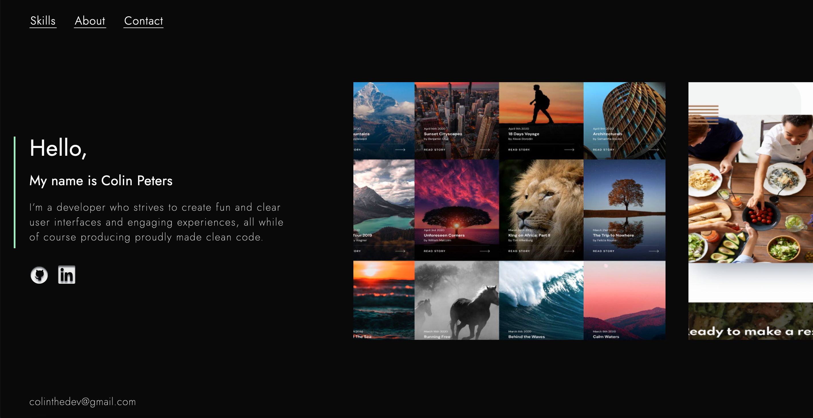

# Personal Portfolio :partying_face:

**Version 2.0**   

## About :point_down:

The purpose for this project is to showcase my latest featured projects and *current* skillset. 
 
 
This project was created from scratch using grid for the main layout and **BEM** method.
>
Deployed using Netlify.

## Design :paintbrush: 

I used **figma** to create the design and **photoshop** for some photo edits. 
 
 
There were **4** other portfolio designs before this one that i had made using figma.
 
 
By the end of the finished product i had incorporated components from the other 4 designs into the final one.

### Created by me using figma:

- **Svg about sec.** :alien:
  - **Lightbulb** :bulb:
    - **Octopus** :octopus:

## Built With 

* HTML-5
* SCSS
* Javascript

## Libraries Used

* [ScrollMagic](https://scrollmagic.io/)  
   >Scroll Magic is a scroll interaction library that allows you to react to the user's current scroll position.

* [GSAP](https://greensock.com/gsap/)  
  >Green Sock is a animation library with a vast selection of plugins

## Key Features

A few key features implemented include:
- :white_check_mark: Smooth scrolling
- :white_check_mark: Horizontal scrolling
- :white_check_mark: Section wipe
- :white_check_mark: Keyframes animation
- :white_check_mark: Fully responsive

## Sections Included

- Projects
  - Skills
    - About
      - Contact

